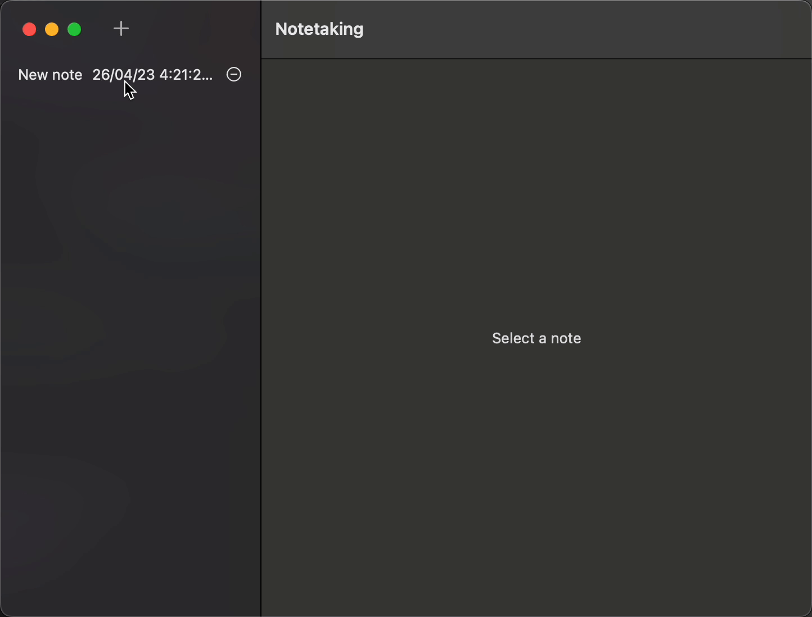

# Practice CoreDat for mac app with SwiftUI 👋

  
  
Mac app developed with SwiftUI using CoreData
  

 
 
<a href="https://github.com/brenfondeadora/Notetaking/issues/new">Report bug</a>
·
<a href="https://github.com/brenfondeadora/Notetaking/issues/new">Request feature</a>

## 🤖 Requirements

## 👤 Author

**Brenda Saavedra**

- WebPage: [brendasaavedra.com](http://brendasaavedra.com)
- Github: [@brsaca](https://github.com/brsaca/)
